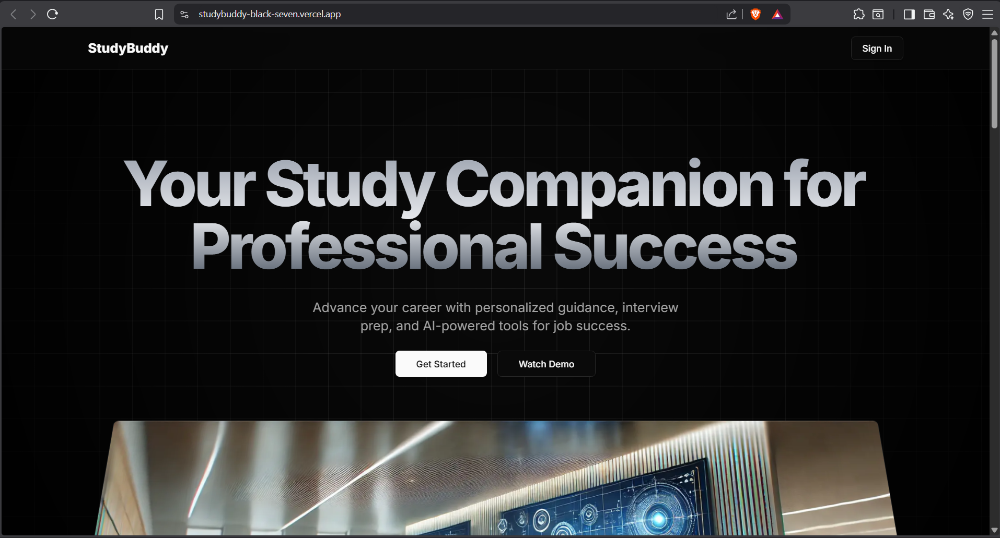

# 🎓 StudyBuddy

> Your Ultimate Career Companion for CS Students

[](https://nextjs.org)
[](https://react.dev)
[](https://tailwindcss.com)
[](LICENSE)

**[🚀 Live Demo](https://studybuddy-black-seven.vercel.app)** | **[📖 Documentation](#quick-start)** | **[🐛 Report Issues](https://github.com/tripcoded/Studybuddy/issues)**

StudyBuddy is a comprehensive platform designed to help Computer Science students excel in their careers. From resume building to interview preparation, we've got you covered.

---

## 🖼️ Screenshots



*StudyBuddy - Your Study Companion for Professional Success*

---

---

## ✨ Features

<table>
  <tr>
    <td width="50%">
      <strong>📄 Resume Generator</strong><br>
      Create professional, ATS-optimized resumes with our intelligent generator
    </td>
    <td width="50%">
      <strong>📝 Cover Letter Generator</strong><br>
      Generate tailored cover letters based on job descriptions
    </td>
  </tr>
  <tr>
    <td>
      <strong>🎤 Mock Interviews</strong><br>
      Practice with AI-powered mock interviews to ace your interviews
    </td>
    <td>
      <strong>📚 Study Material</strong><br>
      Comprehensive resources curated for CS students
    </td>
  </tr>
  <tr>
    <td>
      <strong>🗺️ Career Roadmaps</strong><br>
      Personalized learning paths to develop new skills
    </td>
    <td>
      <strong>💡 Project Ideas</strong><br>
      Curated projects based on skill level and interests
    </td>
  </tr>
  <tr>
    <td>
      <strong>💻 DSA Practice</strong><br>
      Practice Data Structures & Algorithms with explanations
    </td>
    <td>
      <strong>🔗 Open Source Hub</strong><br>
      Discover and contribute to open source projects
    </td>
  </tr>
</table>

---

## 🚀 Quick Start

### Prerequisites
- Node.js 18+ 
- npm or yarn

### Installation

```bash
# Clone the repository
git clone https://github.com/tripcoded/Studybuddy.git
cd Studybuddy

# Install dependencies
npm install

# Set up environment variables
cp .env.example .env.local
# Edit .env.local with your API keys (Clerk, Database, etc.)
```

### Development Server

```bash
npm run dev
```

Open [http://localhost:3000](http://localhost:3000) in your browser to see the application.

---

## 🛠️ Tech Stack

| Category | Technologies |
|----------|---------------|
| **Frontend** | Next.js 15.2.5, React 19, TypeScript |
| **Styling** | Tailwind CSS, Shadcn UI Components |
| **Authentication** | Clerk |
| **Database** | PostgreSQL, Prisma ORM |
| **Deployment** | Vercel |
| **Task Scheduling** | Inngest |
| **UI Components** | Radix UI |

---

## 📁 Project Structure

```
Studybuddy/
├── app/                    # Next.js app directory
│   ├── (auth)/            # Authentication pages (sign-in, sign-up)
│   ├── (main)/            # Main app routes
│   │   ├── dashboard/     # User dashboard
│   │   ├── cover-letter/  # Cover letter generator
│   │   ├── interview/     # Mock interview prep
│   │   └── onboarding/    # User onboarding
│   └── api/               # API routes & integrations
├── components/            # Reusable React components
│   └── ui/               # UI component library
├── lib/                  # Utility functions & helpers
├── prisma/              # Database schema & migrations
├── public/              # Static assets
└── inngest/             # Background job functions
```

---

## 🏃 Available Scripts

```bash
# Development
npm run dev           # Start dev server with Turbopack

# Production
npm run build         # Build for production
npm start            # Start production server

# Code Quality
npm run lint         # Run ESLint
npm run format       # Format code with Prettier (if configured)
```

---

## 📦 Build & Deploy

### Local Build

```bash
npm run build
npm start
```

### Deploy on Vercel

The easiest way to deploy is using [Vercel](https://vercel.com):

1. Push your code to GitHub
2. Import your repository in Vercel
3. Set environment variables in Vercel dashboard
4. Deploy!

```bash
# Environment variables needed:
NEXT_PUBLIC_CLERK_PUBLISHABLE_KEY=<your_key>
CLERK_SECRET_KEY=<your_secret>
DATABASE_URL=<your_database_url>
NEXT_PUBLIC_CLERK_SIGN_IN_URL=/sign-in
NEXT_PUBLIC_CLERK_SIGN_UP_URL=/sign-up
NEXT_PUBLIC_CLERK_AFTER_SIGN_IN_URL=/dashboard
NEXT_PUBLIC_CLERK_AFTER_SIGN_UP_URL=/onboarding
```

---

## 👥 Team

### Dark Koders Development Team

<table>
  <tr>
    <th>Name</th>
    <th>Role</th>
    <th>Responsibilities</th>
  </tr>
  <tr>
    <td><strong>Ankit Singh Yadav</strong></td>
    <td>Team Lead</td>
    <td>Project oversight & strategy</td>
  </tr>
  <tr>
    <td><strong>Om Abhishek Tripathi</strong></td>
    <td>Lead Developer & Administrator</td>
    <td>Development, deployment & maintenance</td>
  </tr>
</table>

---

## 👨‍💼 Project Administrator

<div align="center">
  
  
  <h3>Om Abhishek Tripathi</h3>
  
  <strong>Lead Developer & Project Administrator</strong>
  
  <p>Overseeing all development aspects and ensuring smooth project execution.</p>
</div>

---

## 🤝 Contributing

We welcome contributions! Here's how you can help:

1. Fork the repository
2. Create a feature branch (`git checkout -b feature/amazing-feature`)
3. Commit your changes (`git commit -m 'Add amazing feature'`)
4. Push to the branch (`git push origin feature/amazing-feature`)
5. Open a Pull Request

---

## 📝 License

This project is licensed under the MIT License - see the [LICENSE](LICENSE) file for details.

---

## 📧 Contact & Support

For questions or support, please:
- Open a GitHub Issue
- Check existing issues for solutions
- Review the project documentation

---

## 🌟 Acknowledgments

- Built with [Next.js](https://nextjs.org)
- Styled with [Tailwind CSS](https://tailwindcss.com)
- Components from [Radix UI](https://www.radix-ui.com)
- Authentication by [Clerk](https://clerk.com)

---

<div align="center">
  
  Made with ❤️ by **Dark Koders**
  
  ⭐ If you find this project helpful, please consider giving it a star!
  
  **[🔗 Live Site](https://studybuddy-black-seven.vercel.app)** | **[📚 GitHub](https://github.com/tripcoded/Studybuddy)** | **[💬 Issues](https://github.com/tripcoded/Studybuddy/issues)**
  
</div>
